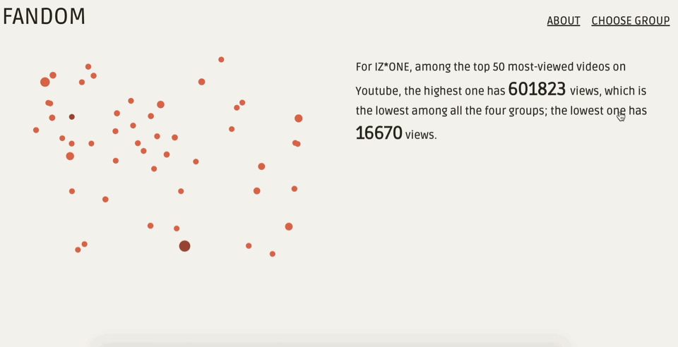

# Fandom Visualization

### Introduction
By analyzing and visualizing data from fan-created contents uploaded on YouTube, this project tries to demonstrate how different K-pop groups may attract different types of fans and, in return, how those fans help to establish a digital representation of K-pop groups through their spontaneously produced contents. The analyze focuses on the following four groups: [BTS](https://en.wikipedia.org/wiki/BTS_(band)), [GOT7](https://en.wikipedia.org/wiki/Got7), [BLACKPINK](https://en.wikipedia.org/wiki/Blackpink), and [IZ*ONE](https://en.wikipedia.org/wiki/Iz%2AOne).

### Demonstration
*Home Page: Showing the overall regional distribution of fan channels*

*Page for BTS*

*Page for GOT7*

*Page for BLACKPINK*

*Page for IZ*ONE*

### Process
- **Data Collection**

  I scripted data from YouTube using [YouTube API](https://developers.google.com/youtube/v3/docs/search). I searched each group and filtered only the fan-created contents, i.e. contents that are uploaded by non-official channels, and ranked them by views. I then exported data of the top 50 videos of each group to .csv files. I also dived into the channels of the top 10 videos and got the data of those 10 channels, including their country/region, number of videos and overall view counts, etc.

- **Data Visualization**

  - For the first page, I binded the channel data with the .geojson data of the world map to show a regional distribution of each fan groups as well as how popular that group is in certain country.

  - For the four individual pages for four groups, I visualized the view counts of each group, as well as the like/dislike ratio. Also, I included a section where you can see the most commonly used category tags for each group, which, to some extent, can reflect what fans care the most about each group.

  - **Compromises**

    - I originally wanted to analyze the title of each video so I can extract the keywords or the words appear most frequently to see what the fans are interested in. But since the titles are all in different languages, it is hard to analyze the titles.

    - For the map on the first page, I planned to make it more interactive and contains more information, like the data for each individual channel, but I failed to achieve it due to time constrains.

### Reflection

Looking backwards, I realized that I should have included a contrast page where I put all the four groups together and see how there fan-created contents differ on YouTube, so that it would be clearer to the audience what they can get out of this project.

Also, if I had more time, I would collect more data from more groups and more various aspects of those videos to have a more comprehensive demonstration of the fans and the groups' digital representation.

But still, I am quite glad to have this data visualization built up successfully and find out some interesting insights that can potentially be used in my capstone project.
